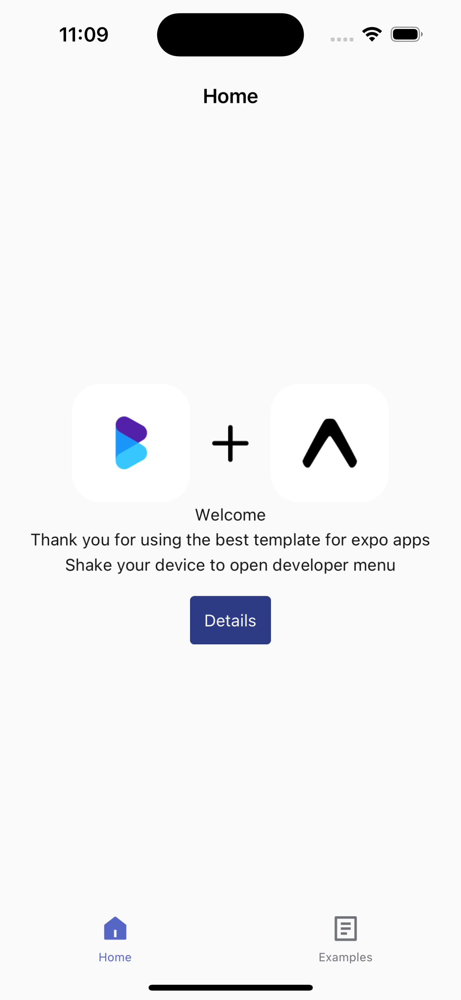
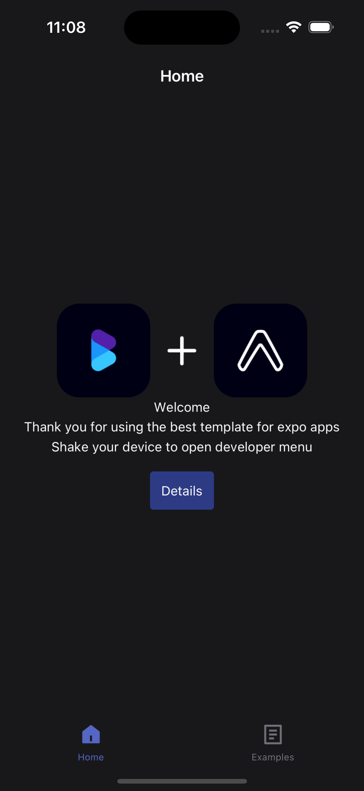
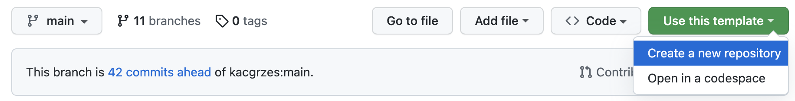
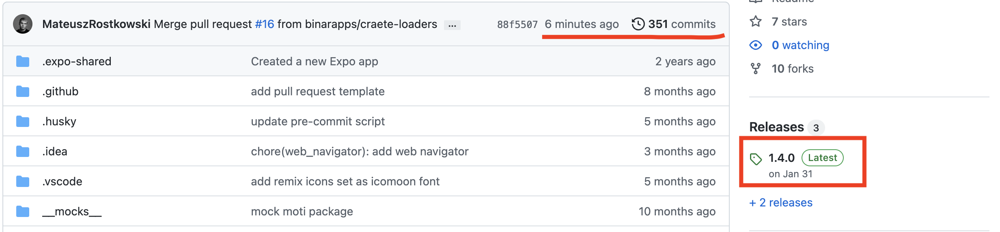

<p align="center">
    
</p>

[](https://github.com/tterb/atomic-design-ui/blob/master/LICENSEs)
[](https://img.shields.io/npm/v/@binarapps/expo-ts-template?style=flat-square)
[](https://img.shields.io/npm/dt/@binarapps/expo-ts-template?style=flat-square)
[](https://img.shields.io/github/stars/binarapps/expo-ts-template?style=flat-square)
[](https://expo.dev/client)

# @binarapps/expo-ts-template

This is a template to be used with expo. It includes all the necessary stuff to start working with expo framework. It has the most popular packages included, so it's easier to start coding the app itself without all the necessary boilerplate setup. It has:

Version in the `package.json` is one to one the latest expo on which the template was tested.

## Why to use?

We know there are a lot of project starters for react native, but we have some good features:

- Fully works with **expo go**
  - Good for start the project and later you can switch to expo-dev-client
- **Code generators** (create new screen / create new component)
- **Fully + Strong typed**
- **App deployment documentation** (currently in progress, but it will be added in near future)

## Demo

<p align="center">
    
    &nbsp; &nbsp;
    
</p>

## Usage

There are three types of usage:

1. Init using this command (beaware that sometimes this template can't be updated on npm, in that case, clone this repository and reinitialize repozitory for yourself - check third type of setup)

```bash
npx create-expo-app --template=@binarapps/expo-ts-template name_of_your_app
```

2. Use this as template repo on GitHub
   

3. Clone repository

   This usage is usefull when npm code version is not up to date, you can verify it by checking dates of last commit and last publish
   

```bash
git clone git@github.com:binarapps/expo-ts-template.git
cd expo-ts-template
yarn
yarn start
```

- in that case you can also reinitialize repozitory if you don't want to keep history of commits

```bash
rm -rg .git
git commit -m "chore: initialize project"
```

### App setup

After setting up repository you can run bootstrap command to setup everything you need:

```bash
yarn bootstrap:new_app
```

This command will ask you for some needed informations and then will overwrite your files in repository.

## Features

[](https://img.shields.io/npm/types/@binarapps/expo-ts-template?style=flat-square)
[](https://img.shields.io/github/package-json/dependency-version/binarapps/expo-ts-template/expo?style=flat-square)
[](https://img.shields.io/github/package-json/dependency-version/binarapps/expo-ts-template/@react-navigation/native?style=flat-square)

### Implemented libraries

- TypeScript
  - app is fully typed
- [Expo v49](https://github.com/expo/expo)
- [React Navigation v6](https://github.com/react-navigation/react-navigation)
- Native-base v3.4
- Prettier and eslint
  - code formatting
  - code checking
- Babel-module-resolver
- jest and @testing-library/react-native
  - unit tests
- i18next
  - translations
  - language detection
- `@gorhom/bottom-sheet`
- Expo-notifications
  - You can read how to configure them [here](/NOTIFICATIONS_SETUP.MD)
- Reactotron
  - used for debugging
- [Reanimated v2](https://github.com/software-mansion/react-native-reanimated)
- Axios

### Implemented custom features

- generators:
  - create screen - `yarn generate:screen`
  - create component - `yarn generate:component`
- support of multiple environments
  - production, staging, qa
- eas configuration
  - update, build, submit
- verifying code on pull request - pipelines
  - when creating pull request on github, there are tests, linters and types checks. If there will be some error you will be notified that something is wrong.
- custom fonts
  - wait to load fonts and all the assets
- dark / light theme support
  - color scheme detection (dark / light mode toggle)
- navigation
  - screen tracking hook
  - state persistence on development mode
  - prevent go back (to be used on forms for example)
  - strong types, prevent issues in future
- auth flow ready for implementation details
  - using expo-secure-store module to save user token
  - right now it has simple signIn/signOut flow
- animations with `reanimated` and `moti`

<!-- ## Screenshots

 -->

## Working with designer in your project

Expo template, you are going to use - bundles native-base ui lib out of the box.
To have the best starting experience in your project - write a dm to your designer that they should use [NativeBase Figma Design Kit](https://www.figma.com/community/file/1050753649783931446)

<!--
  TODO: add documentation
  ## Documentation
  [Documentation](https://linktodocumentation)
-->

## Roadmap

- add some state management tool
- write docs (app deployment, app setup and more)
- tutorial on how to use features
  - navigation
  - deeplinking
  - auth flows
  - components
  - react query
  - api calls
- Add desings (figma) and redesing whole app
- Updating expo versions (in future)
- Deploy app to appstore and playstore
- Improve mock server logic
- add commit lint
- add script that display last update information (eas update)

### Implementations to add

- [expo image](https://github.com/expo/expo/tree/main/packages/expo-image)
- [FlashList](https://github.com/Shopify/flash-list)
- [ZOD](https://github.com/colinhacks/zod)

## Contributing

Contributions are always welcome!

<!-- TODO: Create such files and add hyperlinks to them. -->

See `contributing.md` for ways to get started.

Please adhere to this project's `code of conduct`.

## Run Locally

Clone the project

```bash
  git clone https://github.com/binarapps/expo-ts-template.git
```

Go to the project directory

```bash
  cd expo-ts-template
```

Install dependencies

```bash
  yarn
```

Start the expo server

```bash
  yarn start
```

## Icons

This template uses [Remix icon set](https://remixicon.com/)

It is added to the app as a font generated by [icomoon app](https://icomoon.io/app/#/select).

### Adding new icons

1. Find `assets/icomoon/selection.json` file in your machine
2. Import this file to this [page (icomoon app)](https://icomoon.io/app/#/select):

- Make sure there are no other icons imported there

3. Download icon which need to be added to the app as svg file.
4. Make sure new icon name is unique (already not used).
5. Add svg file to icomoon app.
6. Go to generate font tab - icomoon app.

- Make sure that all icons that you have added have correct names

7. Download font - icomoon app
8. Replace old files with downloaded ones

- ./selection.json => assets/icomoon/selection.json
- ./fonts/icomoon.ttf => assets/icomoon/icomoon.ttf

9. Generate new types for icons

- run script generating icon types `yarn generate:icon:types`

## License

[MIT](https://choosealicense.com/licenses/mit/)

## Feedback

If you have any feedback, please reach out to me at mateusz.rostkowsky995@gmail.com

## Contributors

- [Kacper Grzeszczyk](https://www.github.com/kacgrzes) - @kacgrzes
- [Mateusz Rostkowski](https://www.github.com/MateuszRostkowski) - @MateuszRostkowski
- [Michał Szalowski](https://www.github.com/MSzalowski) - @MSzalowski
- [Jakub Zagórski](https://www.github.com/zagoorland) - @zagoorland
- [Łukasz Patalan](https://github.com/lukasz-patalan) - @lukasz
- [Mario Gliwa](https://github.com/mario688) - @mario688
- [Michał Baumruck](https://github.com/micbaumr) - @micbaumr
- [Andrzej Zaborski](https://github.com/AnMiZa) - @AnMiZa
- [Bartłomiej Sworzeń](https://github.com/Sworzen1) - @Sworzen1
- [Karol Andracki](https://github.com/Karol-Andracki) - @karol-andracki
- [Weronika Grzeszczyk](https://github.com/vercia) - @vercia

## Similar packages

- https://github.com/obytes/react-native-template-obytes
- https://github.com/infinitered/ignite
- https://github.com/wataru-maeda/react-native-boilerplate

### Outdated

- https://github.com/kacgrzes/expo-typescript-template (our repo is for of this one)
- https://github.com/codingki/react-native-expo-template
- https://github.com/flatlogic/react-native-starter
- https://github.com/mcnamee/react-native-expo-starter-kit
