# App deployment with EAS 🕐 / 📱

### Legend

<ul>
    <li>Required to start development - 🚀</li>
    <li>Required to start testing - 🕐</li>
    <li>Required to deploy an app - 📱</li>
    <li>Nice to have - 🌈</li>
</ul>

> **Note!** <br> If you encounter any troubles with building and publishing an app please add a comment and address it to <b>Michał Baumruck</b> or <b>Mateusz Rostkowski</b>

### Terms of content:

<details>
    <summary>When and how to: build, submit, and update an app</summary>

#### Legend
<table>
    <tr>
        <th>Name</th>
        <th>Description</th>
        <th>Type of testing</th>
        <th>Requirements</th>
        <th>When to USE</th>
    </tr>
    <tr>
        <td rowspan="2">Update</td>
        <td rowspan="2">
            <ul>
                <li>Replace javascript/typescript code in mobile app (expo go or native app)</li>
                <li>Use eas update</li>
            </ul>
        </td>
        <td>Expo go</td>
        <td>
            <ul>
                <li>Expo project configuration 🕐</li>
                <li>Testing in Expo Go 🕐</li>
            </ul>
        </td>
        <td>
            <ul>
                <li>When you want to perform fast tests,</li>
                <li>you can add native libraries, but the need to be supported by expo go (check expo docs if library is supported by expo go, for example: https://docs.expo.dev/versions/latest/sdk/accelerometer/)</li>
            </ul>
        </td>
    </tr>
    <tr>
        <td>Native app</td>
        <td>
            <ul>
                <li>App configuration 🕐</li>
                <li>Update</li>
            </ul>
        </td>
        <td>
            <ul>
                <li>When you have only typescript changes</li>
                <li>When you want to update native app</li>
            </ul>
        </td>
    </tr>
    <tr>
        <td>Build</td>
        <td>
            <ul>
                <li>Process of building native app</li>
                <li>Use eas build </li>
            </ul>
        </td>
        <td>Native app</td>
        <td rowspan="2">
            <ul>
                <li>App configuration 🕐</li>
                <li>
                    Before first build go through this:
                    <ul>
                        <li>iOS - Build & deploy the iOS app 🕐 / 📱 </li>
                        <li>android - Build & deploy Android app 🕐 / 📱</li>
                    </ul>
                </li>
            </ul>
        </td>
        <td>
            <ul>
                <li>When you want to build native app</li>
                <li>
                    When you have native changes, for example: 
                    <ul>
                        <li>adding native library</li>
                        <li>changing app icons / app names</li>
                        <li>adding expo plugin - https://docs.expo.dev/config-plugins/plugins-and-mods/</li>
                    </ul>
                </li>
            </ul>
        </td>
    </tr>
    <tr>
        <td>Submit</td>
        <td>
            <ul>
                <li>Process of submitting app to the stores (app store and play store)</li>
                <li>Use eas submit </li>
            </ul>
        </td>
        <td>Native app</td>
        <td>
            <ul>
                <li>When you want to submit app for testers or production users</li>
                <li>When you have created build and you want to submit it (in most cases it will go automatically build + submit)</li>
            </ul>
        </td>
    </tr>
</table>
<br>

#### Types of testing
<table>
    <tr>
        <th>Platform</th>
        <th>Pros</th>
        <th>Cons</th>
    </tr>
    <tr>
        <td>Expo go</td>
        <td>
            <ul>
                <li>Fast</li>
                <li>Easy</li>
                <li>Automated way to distribute app</li>
            </ul>
        </td>
        <td>
            <ul>
                <li>Can't test native modules that are not supported by expo go like: firebase analytics,  onesignal</li>
                <li>It's little different than native app, will need additional tests after testing in expo go</li>
            </ul>
        </td>
    </tr>
    <tr>
        <td>Native app</td>
        <td>
            <ul>
                <li>Testing all native modules</li>
                <li>Supports expo plugins</li>
            </ul>
        </td>
        <td>
            <ul>
                <li>Complicated build process (only for first time)</li>
                <li>Complicated distribution and installation on devices (only for first time)</li>
            </ul>
        </td>
    </tr>
</table>
</details>
<br>
<details>
    <summary>Testing in Expo Go 🕐 </summary>

When to use the Expo Go app:

<ul>
    <li>If you are developing an app - for other developers and for fast internal testing</li>
    <li>If you are developing an app, and do not have access to App Store and Google Play Store - for internal and external testing</li>
</ul>

When not to use the Expo Go app:

<ul>
    <li>
        If you have applied native features to an app for example - one-signal (libraries that need to apply native code to the app with expo-plugins)
        <ul>
            <li>in that case, you could use expo-dev-client to create your own Expo Go app with injected native code into it</li>
        </ul>
    </li>
</ul>

### Process:

1.Deploy app for tests in expo go.

The easiest way to allow testers to test an app on physical devices is to deploy the app to Expo Go.

If you follow the previous steps of instructions, have configured the expo project, logged into the Expo account, and have added an app configuration, you will be ready to deploy an app with just one command.

In terminal run:

```bash
yarn update:expo_go
```

2.Test the app on the physical device
<ol type="a">
    <li>
        Install the Expo Go app from Play Store (Android) or from App Store (iOS). <br>
        Your app will run in the Expo Go application as the wrapper to your original app.
    </li>
    <li>Log in to your Expo account in the Expo Go app.</li>
    <li>Select the proper organization, in which your app is deployed.</li>
    <li>Select the proper project (your app).</li>
    <li>Select the proper branch from which your build (update) was done.</li>
    <li>Select the proper build (update), that you want to test. </li>
</ol>

### Summary:

<ul>
    <li>You should have in mind that testing in the Expo Go app is limited to apps that do not apply native features for example - one-signal (libraries that need to apply native code to an app with expo-plugins).</li>
    <li>
        Testing inside the Expo Go app is divided by a branch (git branch) from which are generated builds (updates) - could be done for example - for every feature branch
        <ul>
            <li>you can easily switch between different branches - for example - test multiple features from code review just in one place (Expo Go)</li>
        </ul>
    </li>
    <li>
        If multiple builds (updates) are generated for the same branch, in the Expo Go app you can switch between each build 
        <ul>
            <li>you can easily switch between different builds (on the same feature branch) for example -to check when something was broken</li>
        </ul>
    </li>
</ul>
</details>
<br>
<details>
    <summary>Build & deploy the iOS app</summary>

1.Build first iOS binary 🕐 / 📱

<ol type="a">
<li>Check if you are already logged in to your eas/expo account</li>

```bash
eas whoami
```

If not please log in to your account before proceeding to the next step.

<li>In the terminal run the build command (choose the proper environment (qa/staging/production).</li>

```bash
yarn build:[qa/staging/production]:ios
```

<li>You will be asked to log in to your Apple account, please log in.</li>
<li>Choose your team and provider (possible binarapps if you deploy qa app).</li>
<li>
    If it will be your first build of the iOS app, you will be prompted to generate a new Apple Distribution Certificate." <br>
    If it is a new app please select y, otherwise, if you have Apple Distribution Certificate (.p12 file) you can press n and provide a path to .p12 certificate.
</li>
<li>
    If it will be your first build of the iOS app, you will be prompted to generate a new Provisioning Profile. <br>
    If you do not have Provisioning Profile please select y to generate a new one, otherwise, if you have Provisioning Profile (.mobileprovision file) you can press n and provide a path to .mobileprovision certificate.
</li>
<li>
    If it will be your first build of an iOS app, you will be asked to set Push Notifications for your project. <br>
    You can select y in case later you could need it, and generate a new Apple Push key.
</li>
</ol>

CONGRATULATION !! 🥳🥳 You just started your first IOS build of the QA app version!

2.Deploy the first iOS app version for tests in TestFlight. 🕐 / 📱

<ol type="a">
<li>
Creating new apps in App Store Connect <br>
When you created an iOS binary (your build is in progress or at least you've generated Distribution Certificate (.p12 file) and Provisioning Profile (.mobileprovision file)), you are ready to create and configure apps in App Store Connect. <br>
<ol type="I">
<li>Log in to App Store Connect to the account you were logged in to while building the app in the previous step.</li>
<li>
Create a new app. <br>
1.Got to the Apps tab.

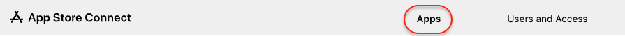
2.Click on the +button to create a new app.

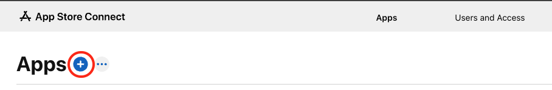
3.Select New app from the popup.

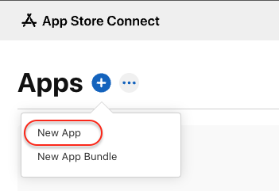 <br>
4.Fill out the questionnaire about the newly created app.

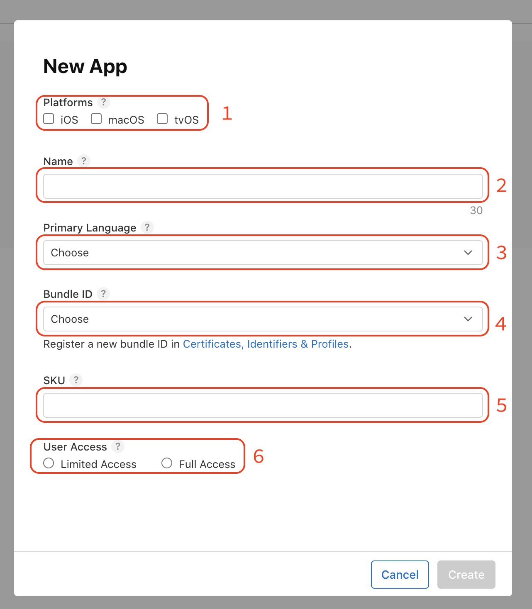 <br>

Fields description: <br>
1)Choose the platform which you want to support (probably only iOS). <br>
2)Add your app name. Depending on the type of your app, you are creating:
<br>
<br>
a)your app name (qa) <br>
b)your app name (staging) <br>
c)your app name <br>
<br>

3)Choose your primary language (English, Polish, or some other). <br>
4)Choose your bundle id.
<br>
<br>
When you went through the building app process correctly you should be able to choose the bundle id created for your app for example:
binarappsYOURAPPNAME 344h234g234d23423f4234 - com.binarapps.yourappname  - last part is your app bundle id, you should choose accurate to the app version (qa/staging/production)

<br>

5)You need to pass a unique ID that will not be visible in the store, it could be your bundle id for example com.binarapps.yourappname.qa <br>
6)You could choose limited access, only accounts with the role: Admins, Finance, and Reports, and people you add access will see the app in the App Store account
</li>
<li>Create and go through step ii again to cover qa/staging/production app depending on your strategy.</li>
</ol>
</li>
<li>
Submit the app to the Test Flight.
<ol type="I">
<li>
Configure eas.json file.

```
"submit": {
   "production": {
     "ios": {
       "ascAppId": "your_appStore_app_id",
       "appleTeamId": "your_apple_team_id",
       "appName": "your_app_name"
     }
   },
   "staging": {
     "ios": {
       "ascAppId": "your_appStore_app_id",
       "appleTeamId": "your_apple_team_id",
       "appName": "your_app_name"
     }
   },
   "qa": {
     "ios": {
       "ascAppId": "your_appStore_app_id",
       "appleTeamId": "your_apple_team_id",
       "appName": "your_app_name"
     }
   }
 }
```

Where: <br>
- your_appStore_app_id should be taken in that way.
- your_apple_team_id should be taken from Apple Developer Portal in that way.
- your_app_name should be your app name from App Store Connect.

<br>
</li>
<li>
    The first submission - authenticate the app submission process. <br>
    You can authenticate your builds in two different ways: <br>

1.<b>App Store Connect API Key.</b> <br>
To use this method you will need access to the App Store Connect account with the role of Account Holder. If you do not have such access, please authenticate with method <br>

<ol type="a">
<li>Generate API key - follow the instruction.</li>
<li>Save AuthKey.p8 file, key ID, and Issuer ID.</li>
<li>
Ensure that the build you want to submit is completed correctly. <br>
In project dir terminal run:

```bash
eas build:list --channel [qa/staging/production]
```

And check the last build. (choose the proper channel depending on your build/app environment)
</li>
<li>
Start the submission process, in project dir run the following command:

```bash
eas submit -p ios --latest
```

If you want to submit a different build than the latest one, you can run:

```bash
eas submit -p ios --id your_build_id
```

Where in place of your_build_id you could pass the id of the build from the build list (previous step). <br>
<br>
For the first submission you will need to go through the following questions:

- Select what to use for your project: Add a new ASC API Key
- Generate a new App Store Connect API Key:  no
- Path to App Store Connect API Key: AuthKey_YOUR-KEY-ID.p8
- Key ID: YOUR-KEY-ID (to be get from the instruction)
- Issuer ID: YOUR-ISSUER-ID (to be get from the instruction)

<br>
After applying this data submission process will start. CONGRATULATIONS !! 🥳🥳 You have just started your first iOS build submission!
</li>
</ol>
</li>
</ol>
</li>
</ol>

2.<b>Apple App-Specific Password.</b>
<ol type="a">
<li>
Generate App-Specific Password - follow the instruction. <br>
You can name your App-specific password for example as EAS submit.
</li>
<li>Copy the newly generated password. (if not copied, please create a new App-Specific Password, and remove the previous one).</li>
<li>
Store password in expo service (we will name it → EXPO_APPLE_APP_SPECIFIC_PASSWORD). <br>
In project dir terminal run:

```bash
eas secret:create --scope project --name EXPO_APPLE_APP_SPECIFIC_PASSWORD --value YOUR_GENERATED_APP_SPECIFIC_PASSWORD --type string
```

In place of YOUR_GENERATED_APP_SPECIFIC_PASSWORD provide your generated password.
</li>
<li>
Configure eas.json file, to authenticate the submission process with your App-Specific Password. <br>
Add the following lines (do not remove existing configuration added in 4.b.i step).

```
"submit": {
    "production": {
      "ios": {
        "appleId": "your_apple_id",
      }
    },
    "staging": {
      "ios": {
        "appleId": "your_apple_id",
      }
    },
    "qa": {
      "ios": {
        "appleId": "your_apple_id",
      }
    }
} 
```

Where your_apple_id is your apple ID with access to App Store Connect. (for example m.baumruck@binarapps.com)
</li>
<li>
Store your apple account password as an expo secret in the expo service. <br>
To allow other users and CI to submit the app to the store, and sign in with an app-specific password, you need to allow expo services to authenticate with your account. To do that, expo service will log in to your apple account with your apple id (provided in eas.json in the previous step and apple password (stored as a secret on the expo service). <br>
In project dir terminal run: 

```bash
eas secret:create --scope project --name EXPO_APPLE_PASSWORD --value YOUR_APPLE_PASSWORD --type string
```

In place of YOUR_APPLE_PASSWORD provide your apple password.
</li>
<li>
Start the submission process, in project dir run the following command:

```bash
eas submit -p ios --latest
```

If you want to submit a different build than the latest one, you can run:

```bash
eas submit -p ios --id your_build_id
```

Where in place of your_build_id you could pass the id of the build from the build list (previous step). <br>
<br>
CONGRATULATIONS !! 🥳🥳 You have just started your first iOS build submission!
</li>
</ol>

3.Build and deploy the next versions of the app to TestFlight. 🕐 / 📱 <br>
<br>
To run this step, ensure that you already have built and deployed the first version of the app (it means, that you need to go through steps 3 and 4 for qa/staging/production version of the app depending on your needs)

In project dir run in terminal:

```bash
yarn deploy:[qa/staging/production]:ios
```

Choose the proper app version depending on the environment for which you want to create a build. 
</details>
<br>
<details>
    <summary>Build & deploy the Android app</summary>

1.Build first Android binary 🕐 / 📱

<ol type="a">
<li>
Select the proper build type <br>
You need to decide if you want to build an app that will be shared with Google Play Store or if it will be sent directly to final users.

If it will be deployed to the store you should build an <b>app-bundle</b> (.aab) file otherwise an <b>apk</b> (.apk) file. <br>
<br>

Configure buildType in eas.json as follows:

```
{
    "build": {                           
        "production": {
            "android": {
                "buildType": "app-bundle" // you can choose here between apk and app-bundle
                // ...rest of the properties
            }
        },
         "staging": {
            "android": {
                "buildType": "app-bundle" // you can choose here between apk and app-bundle
                // ...rest of the properties
            }
        },
         "qa": {
            "android": {
                "buildType": "apk" // you can choose here between apk and app-bundle
                // ...rest of the properties
            }
        }
    }
}
```

</li>
<li>
In the terminal run the build command (choose the proper environment (qa/staging/production)

```bash
yarn build:[qa/staging/production]:android
```
</li>
<li>
⚠️ You will be asked to generate a new Android Keystore. ⚠️

If your app already exists (perhaps the app has already been deployed to the store) and you have the Keystore file press <b>n</b> and follow the steps. <br>

If you do not have the Keystore file yet press <b>y</b>. <br>
<br>
CONGRATULATION !! 🥳🥳 You just started the first Android build of your app!
</li>
</ol>

2.Deploy the first version of the Android app for tests in Google Play Store. (internal testing) ?? / ?? <br>
The first submission to Google Play Store needs to be done manually.
<ol type="a">
<li>Log in to Play Developer Console.</li>
<li>
Choose your developer account (if you have more than one):

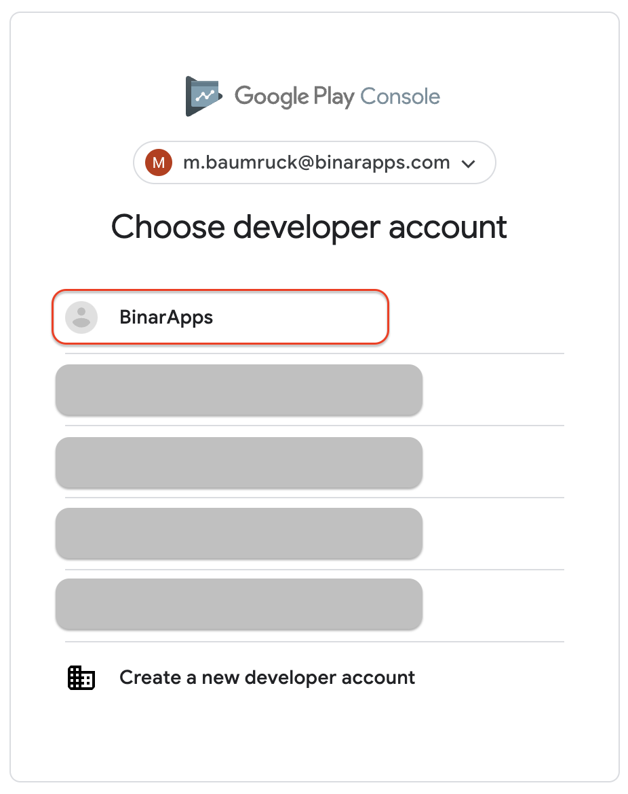
</li>
<li>
Create new app
<ol type="i">
<li>
Press Create App button on the right

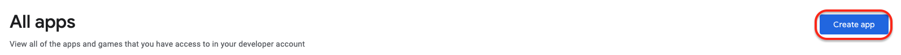
</li>
<li>
Fill out the form for creating about new App.

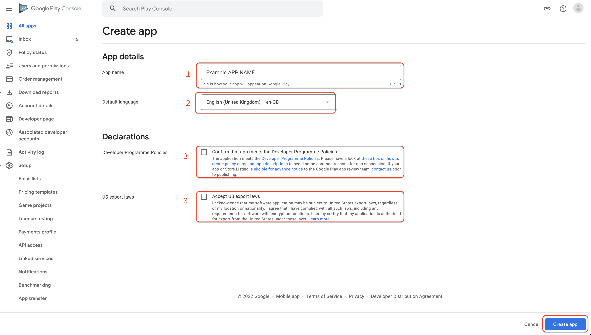

Fields description:

1)Add your app name. Depending on the type of your app, you are creating: <br>
<br>
a)your app name (qa) <br>
b)your app name (staging) <br>
c)your app name <br>
<br>
2)Choose your primary language (English, Polish, or some other).

3)Confirm Developer Programme Polices and US export laws <br>
<br>
</li>
<li>
Press Create app button in the right bottom corner (picture in the previous step). <br>
You should create a new app for each environment you need to use (e.g. qa, staging, production).
</li>
</ol>
</li>
<br>
<li>
Download your build file (<b>apk</b> or <b>app-bundle</b>) from the expo dev console.
<ol type="i">
<li>Log in to the expo dev console.</li>
<li>Choose your organization from the dropdown in the top left corner.</li>
<li>Choose your project from the left sidebar.</li>
<li>
Choose Builds tab from the left sidebar.

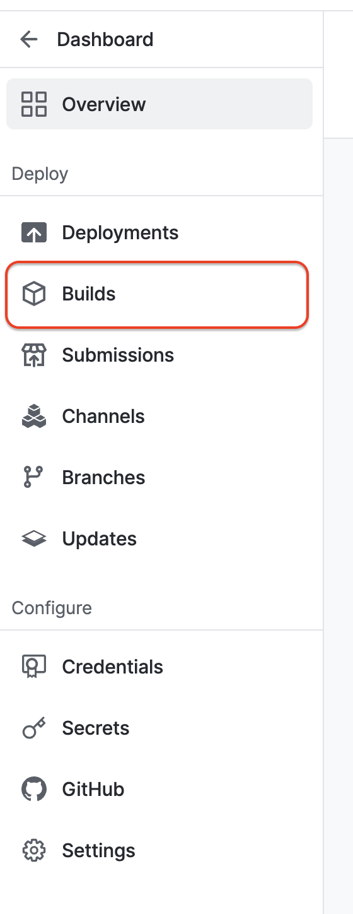
</li>
<li>
Pick a build you want to release for testing

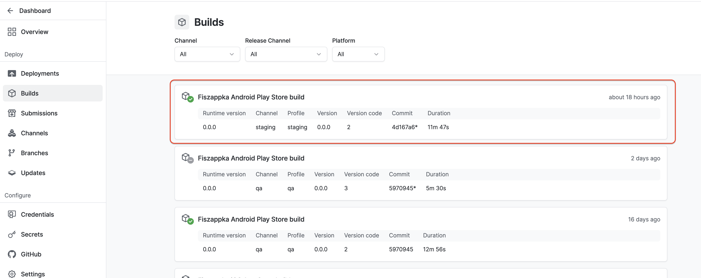
<br>
<br>
Sometimes if you do not see the build which you want to download, you may need to refresh the page (there is some heavy caching on the Expo site).
</li>
<li>
Download the build binary file. 

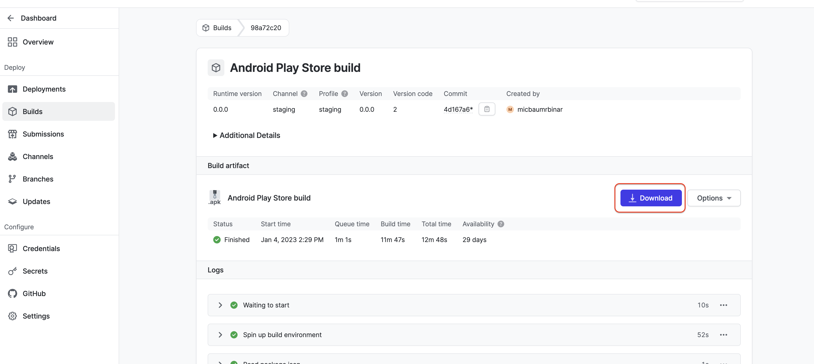

If you downloaded an <b>apk</b> file, you can share this file directly with your end users (could be sent via slack, diawi, google drive, etc.).

If you downloaded an <b>app-bundle</b> file, it will be used in the next step.
</li>
</ol>
</li>
<li>
Prepare the internal test.
<ol type="i">
<li>
Go to the Internal testing tab from the menu on the left (ensure you are working on the proper app - the app name is visible in the right top corner) 

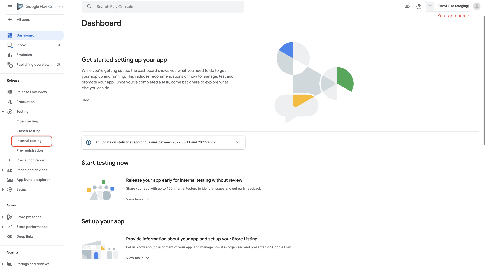
</li>
<li>
Press Create new release button.

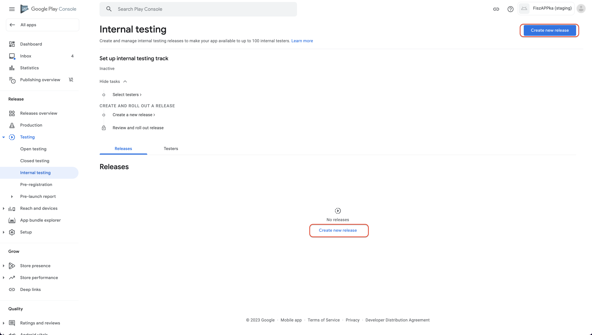

</li>
<li>
Upload the binary file (downloaded in the previous step <b>app-bundle</b> file - .aab) and fill out the release form.

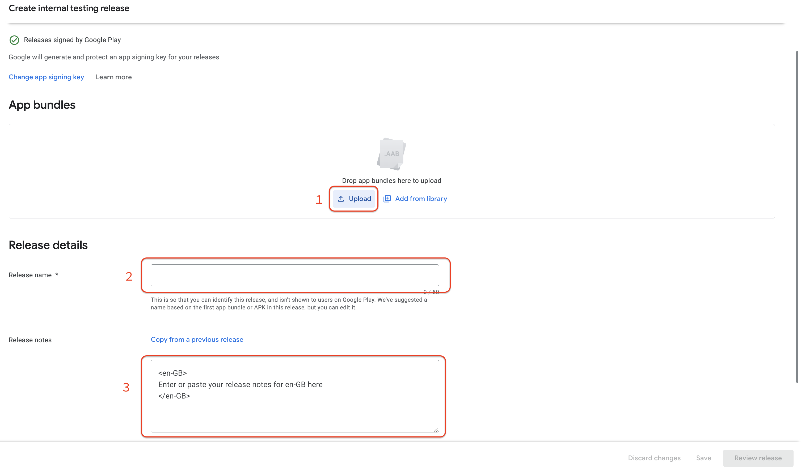

Fields description: <br>
1)Button to upload binary file (upload binary download in the previous step (7.d). <br>
2)Release name - will be automatically filled based on your build number and app version. You could change it to any other name. <br>
3)Release notes - notes visible for users in the Play Store talking about changes in the current version of the app.
</li>
<li>
Press Review release button

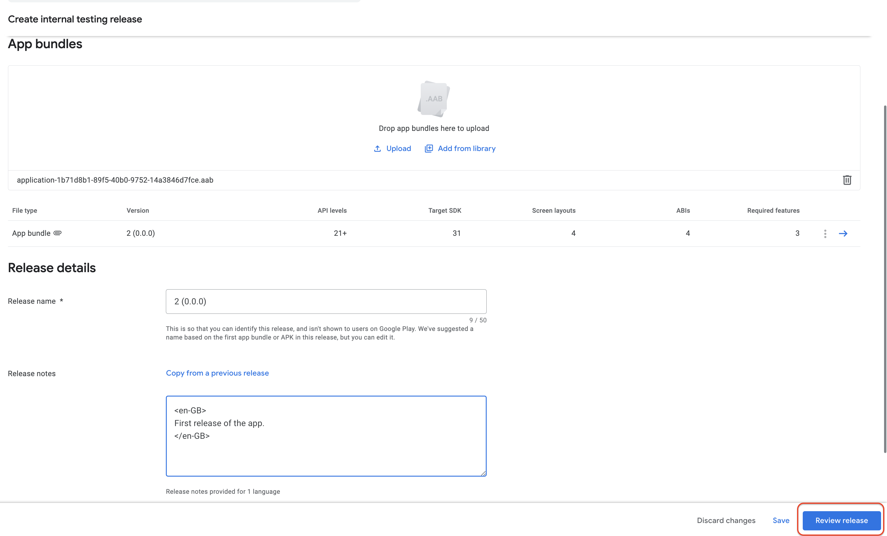
</li>
<li>
Rollout new release

If your app does not have any issues (there will be shown no errors) it means that is ready to go public. <br>
<br>
Press Start roll-out internal testing button

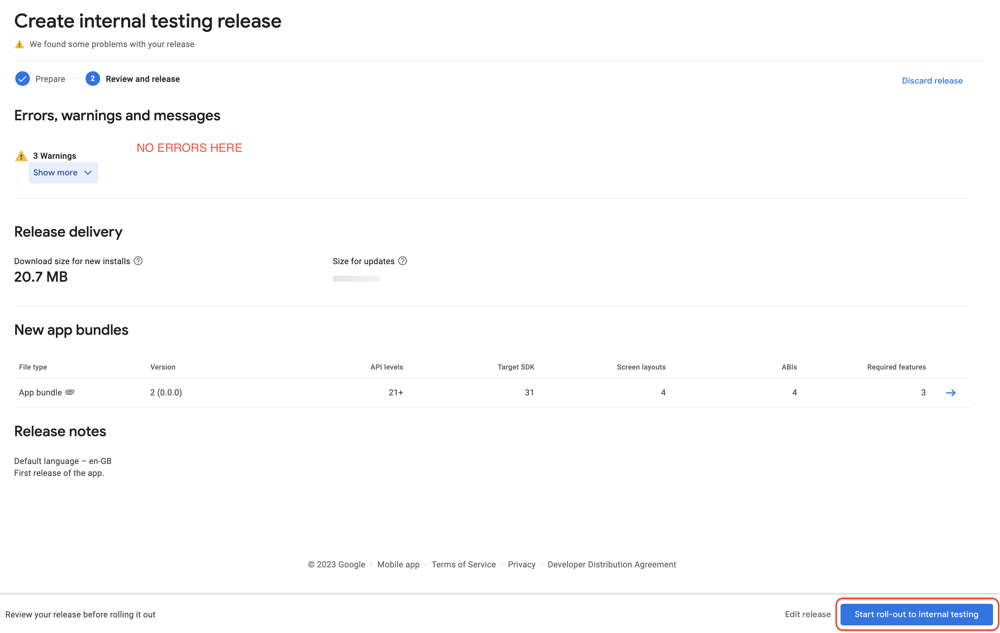

If you meet any errors, you need to resolve them before releasing an app for internal testing.
</li>
<li>
Confirm roll-out operation modal

Press the Rollout button.

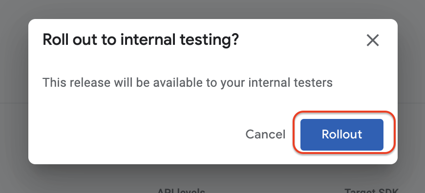

CONGRATULATION !! 🥳🥳 You just released the first version of the app for internal testing.
</li>
</ol>
</li>
<li>
Invite testers to test your app.
<ol type="i">
<li>Go to the internal testing tab (7.e.i)</li>
<li>
Enter Testers tab

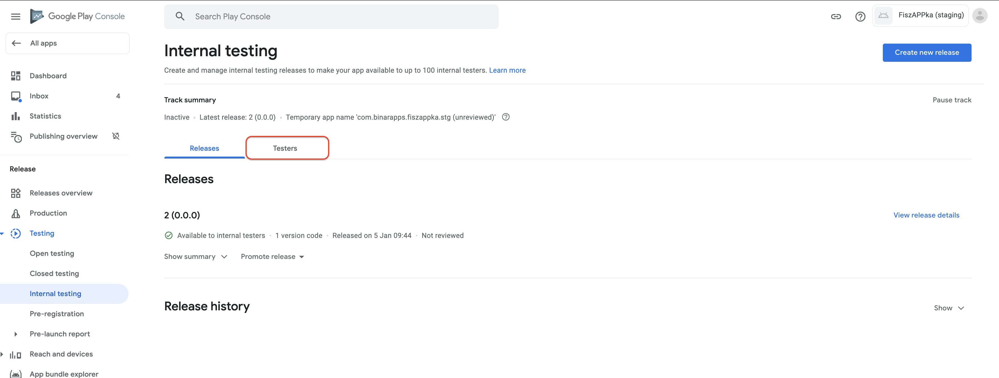
</li>
<li>
Add testers.

You can add testers in two different ways.

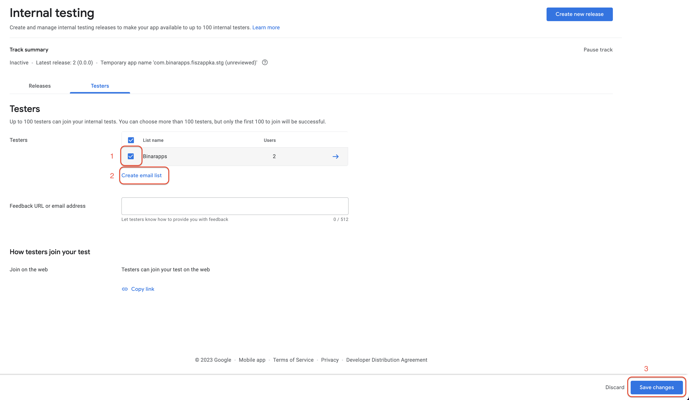

1)Select an already define (if you have such) list of testers for example Binarapps <br>
2)Create a new list of testers. You will need to add names and testers' emails to the list. <br>
<br>
To apply any changes press Save changes button in the bottom right corner.
</li>
<li>
Send invitation link to testers.

1.Press Copy link button

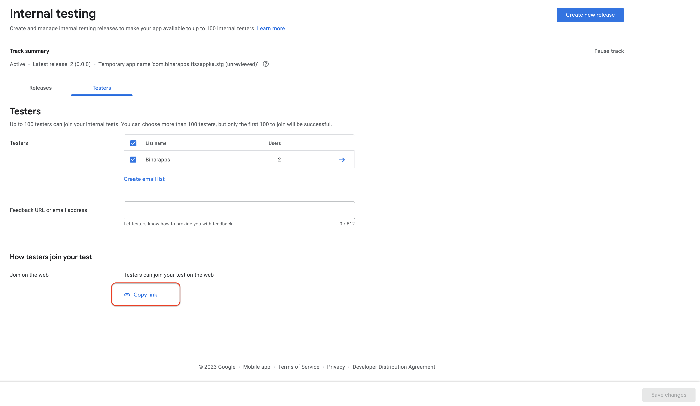

2.Send copied link to testers.

Testers should enter the link in web browser (ideally on a mobile device) when they are logged in to the email address provided on the testers list. Otherwise, the link could be opened in incognito mode - login is required to the proper Google Account.<br>
<br>
3.Testers should accept invitation by pressing Accept invite button.

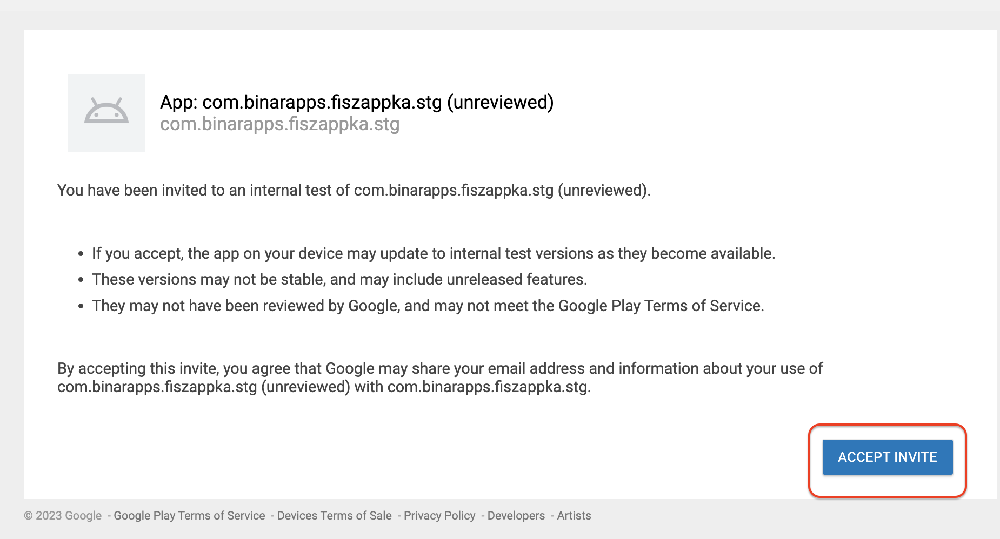

4.Testers are now able to download an app from Google Play Store - press the button download it on Google Play.

The link needs to be opened on an Android device, otherwise, the installation will not be possible.

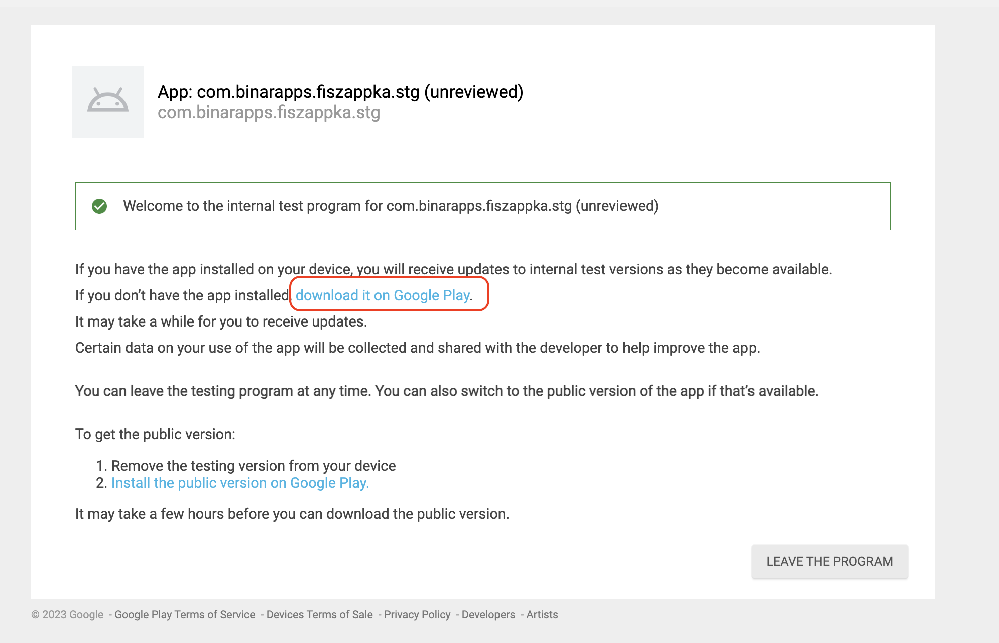

CONGRATULATION !! 🥳🥳 You just invited the first tester of the app for internal testing.
</li>
</ol>
</li>
</ol>
<br>
3.Build and deploy the next versions of the app to the Google Play Store. 🌈 / 🕐 / 📱 <br>
<br>
To run this step, ensure that you already have built and deployed the first version of the app (it means, that you need to go through steps 6 and 7 for qa / staging / production version of the app depending of your needs) <br>
<br>
Only the first submission of the Android app needs to be done manually. Every next submission could be automated 🥳. <br>
To make it possible, <b>Google Service Account</b> key file needs to be provided.

<ol type="a">
<li>
Generate <b>Google Service Account</b> key → follow the instruction.

To generate the above you will need to contact with account owner of your project.
</li>
<li>Put generated <b>Google Service Account</b> key in the root dir of your project.</li>
<li>
Add Google Service Account key to .gitignore file.

```
your_google_service_account_key.json
```
</li>
<li>
Configure eas.json to use the <b>Google Account Service</b> key, and to send a new app version for the internal testing path.

```
"submit": {
    "production": {
      "android": {
        "serviceAccountKeyPath": "path_to_your_google_service_account_key",
        "track":"internal"
      }
    },
    "staging": {
      "android": {
        "serviceAccountKeyPath": "path_to_your_google_service_account_key",
        "track":"internal"
      }
    },
    "qa": {
      "android": {
        "serviceAccountKeyPath": "path_to_your_google_service_account_key",
        "track":"internal"
      }
    }
}
```
</li>
<li>
Build and deploy a new version of the app

In project dir terminal run:

```bash
yarn deploy:[qa/staging/production]:android
```

Choose the proper app version depending on the environment for which you want to create a build. <br>
<br>
CONGRATULATION !! 🥳🥳 You have just automated the build and deployment process for Android!
</li>
</ol>
</details>
<br>
<details>
    <summary>Build & deploy both Android and iOS apps</summary>

<ol>
<li>
Build and deploy the next version of Android and iOS simultaneously.  🌈 / 🕐 /📱

If you automated the submission process for Android and iOS (step build and deploy iOS app and step build and deploy Android app) you can build and upload both Android and iOS apps with just one command. <br>
<br>
In project dir terminal run:

```bash
yarn deploy:[qa/staging/production]
```

Choose the proper app version depending on the environment for which you want to create a build. <br>
<br>
CONGRATULATION !! 🥳🥳 You have just learned how to run the build and deploy process with just one command for both Android and iOS!
</li>
</ol>
</details>
<br>
<details>
    <summary>Update 🕐</summary>

Remember, you can use EAS update only to publish changes to the update layer of code → Javascript/Typescript code, image assets etc.

If you need to update any app config, app icon, splash or native code inside the binary etc. you need to create new build.

<ol>
<li>What is EAS update? </li>
<li>When to use EAS Update? </li>
<li>When to not use update?</li>
<li>
How to use update?
<ol>
<li>branch</li>
<li>release channel</li>
<li>configuration - eas.json</li>
</ol>
</li>
</ol>
</details>
