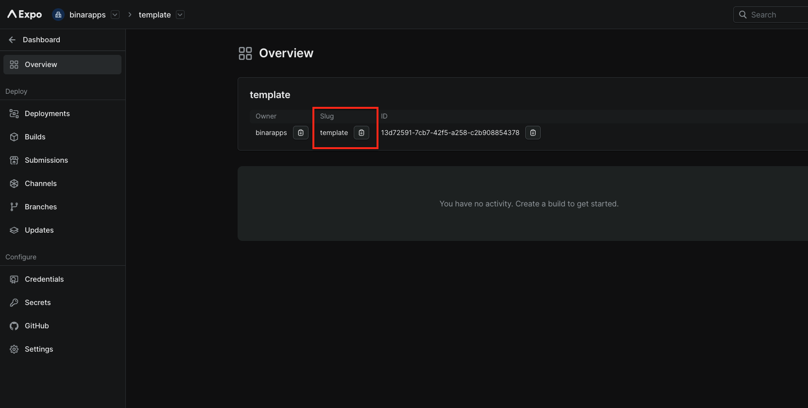
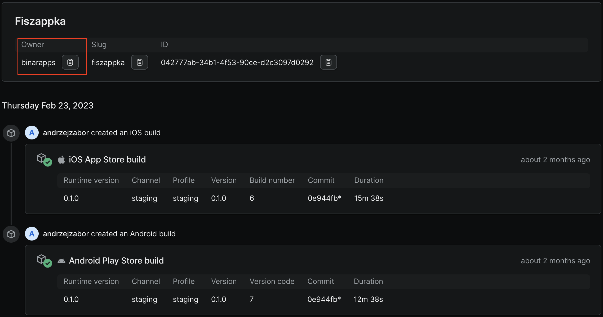
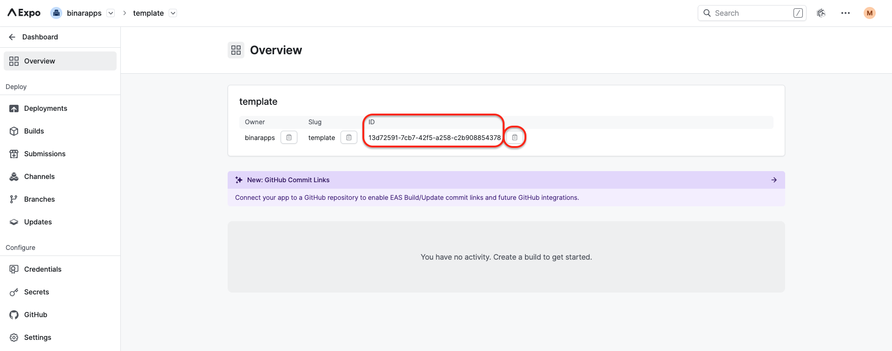

# BOOTSTRAP (start development)

**tl;dr:** Bootstrap project structure, that is needed to start development

## Preparation

<hr>

### **What you need to do to start development**

<details>
  <summary>1. Clone this repository</summary>
  
  There are three types that you can clone the repo:

1. Init using this command (beaware that sometimes this template can't be updated on npm, in that case, clone this repository and reinitialize repozitory for yourself - check third type of setup)

```bash
npx create-expo-app --template=@binarapps/expo-ts-template name_of_your_app
```

2. Use this as template repo on GitHub
   

3. Clone repository

   This usage is usefull when npm code version is ot up to date, you can verify it by checking dates of last commit and last publish
   

```bash
git clone git@github.com:binarapps/expo-ts-template.git
cd expo-ts-template
yarn
yarn start
```

- in that case you can also reinitialize repozitory if you don't want to keep history of commits

```bash
rm -rg .git
git commit -m "chore: initialize project"
```

</details>

<details>
  <summary>2. Create project on expo.dev</summary>
  
  You need prepare some catchy name for you app, if not provided by client
</details>

<hr>

### **What you need to prepare:**

<details>
  <summary>1. App name</summary>
  
  You need prepare some catchy name for you app, if not provided by client
</details>

<details>
  <summary>2. App slug</summary>
  
  
  
  You can find it in expo console
</details>

<details>
  <summary>3. Organziation owner (default to binarapps)</summary>



You can find it in expo console

</details>

<details>
  <summary>4. Eas project id</summary>
  
  
  
  You can find it in expo console
</details>

<details>
  <summary>5. Provide necessary assets for your application (app icons and splash screen).</summary>
  
  [Expo recommendations about app icons and splash screen.](https://www.figma.com/file/gDLi6LNtNq50FycJ30t7rw/Expo-App-Icon-%26-Splash-(Community)?node-id=1-1357&t=VbJUpoye07JAuVLv-0)

App icons for Android and iOS devices need to follow different requirements - all necessary requirements can be found here.
Config inside the app is prepared that your icons will be named respectively:

- for Android:
  - prepare background color
  - adaptive-icon-qa.png
  - adaptive-icon-staging.png
  - adaptive-icon-production.png
- for iOS:
  - icon-qa.png
  - icon-staging.png
  - icon-production.png
- for web:
  - favicon-qa.png
  - favicon-staging.png
  - favicon-production.png
- splash screen:
  - splash.png

and placed in proper folders:

- for android: assets/icons/android
- for ios: assets/icons/ios
- for web: assets/icons/web
- splash screen: assets

For the Android adaptive icon, you should also provide proper background color as it needs to be uploaded with transparent background. It should be configured in app.config.ts file as follows:

app.config.ts
// CONFIG: Add your android adaptive icon background color here
adaptiveIconBackgroundColor: {
production: 'bg_color_production',
staging: 'bg_color_staging',
qa: 'bg_color_qa',
},

</details>

<details>
  <summary>6. App identifiers</summary>
  
  Your application should have unique identifiers of your app (they will be used in stores), they are respectively: 
   - for Android - app package name
   - for iOS - bundle identifier

They could have the same value for android and iOS, and normally they have a structure like this:
`com.your_company_name.your_project_name`

If you have some domain, for example: example.com, your bundle id could be: `com.example`

</details>

<details>
  <summary>7. URL scheme</summary>
  
  URL scheme link into your app. For example, if we set this to 'demo', then `demo://` URLs would open your app when tapped.
  It is only available in standalone apps.
</details>

<details>
  <summary>You should have data like this:</summary>
  
  You can generate this data and save it in some notepad or somewhere else.
  ```json
  {
    "androidPackageName": "your_android_package_name",
    "iosBundleIdentifier": "your.ios.bundle.identifier",
    "appName": "Your name",
    "owner": "expo_owner_name",
    "slug": "expo_app_slug",
    "easProjectId": "xxx-xxx-xxx-xx",
    "scheme": "your_url_scheme",
    "adaptiveIconBackgroundColor": "#2E7AF0CC"
  }
  ```
</details>

<hr>

## Bootstraping project

### **After you will collect all necessary data run this command:**

```sh
yarn bootstrap:new_app
```
