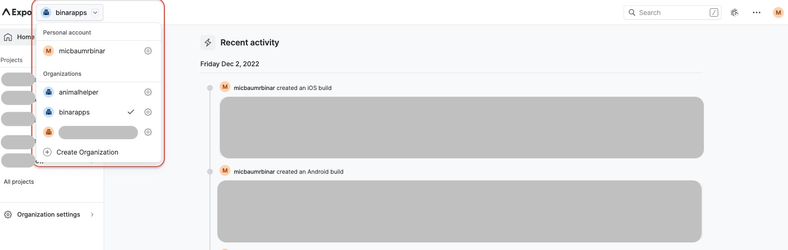
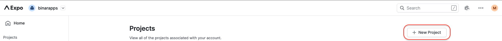
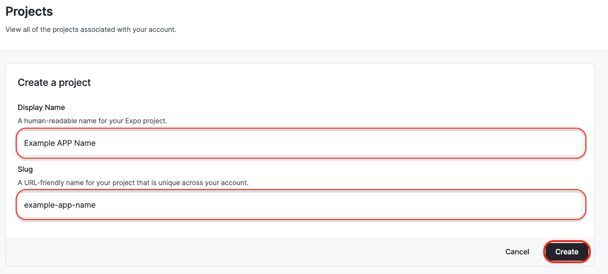

# Expo project configuration 🕐

<details>
    <summary>1.Create a new project in the expo dev console.</summary>

a. Sign in to the expo dev console (account created in the first step of repo configuration).

b. Select the proper organization you are working for from a dropdown:



Ideally, it will be an organization created by the client (especially for production builds), to easily pass access after the end of development.

c. Create a new Project in the organization.

I. From the sidebar menu click <b>All projects</b> button:


II. On the page with the list of projects click <b>+New Project</b> button:



III. Apply <b>display name</b> and <b>slug</b> of your project.

Display name is a name that will be visible in the Expo Dev Console. <br>
Slug is the name that will link your Expo application with your code.


</details>
<br>
<details>
    <summary>2.Sync project with code.</summary>
Synchronize the newly created Expo Project to your app. <br>
In app.json file please insert the following: <br>
a. <b>slug name</b> - created in 1-st point. 
b. <b>owner</b> - organization picked from the list in 1-st point

```bash
{
 "expo":
   {   
       "owner": "your_organization_name",
        "slug": "example-app-name"
   }
}
```
</details>